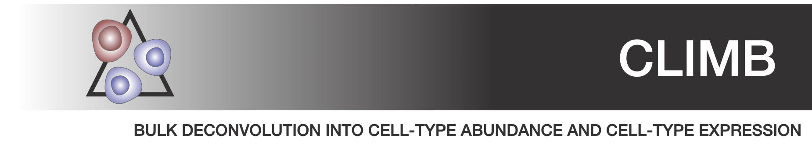
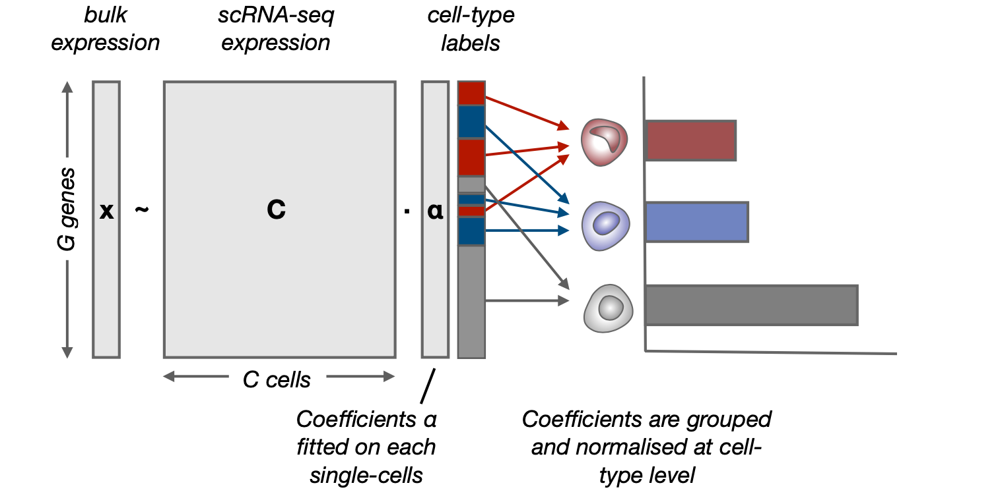

.. pyTEnrich documentation master file, created by
   sphinx-quickstart on Wed Dec 30 11:29:02 2020.
   You can adapt this file completely to your liking, but it should at least
   contain the root `toctree` directive.

.. toctree::
   :maxdepth: 1
   :caption: Contents: 
   
   usage/installation.rst
   usage/execution.rst
   usage/detailmethods.rst
   usage/results.rst
   
Overview of the method
=======================

**CLIMB** dissects the cellular composition and the cellular expression of bulk samples by finding the best combination of single cells using a scRNA-seq dataset as a reference to reconstruct bulk expression using bulk RNA sequencing target sample. The learned single-cell to bulk sample mapping can then be grouped to obtain cell-subtype abundance and cell-subtype expression.

**CLIMB** relies on a linear regression model. Its novelty come from avoiding to rely on signature matrix to perform bulk deconvolution. It indeed fit coefficients at the single-cell level before grouping it at cell-type level. See in more details **CLIMB** method in :ref:`detailmethods`.
